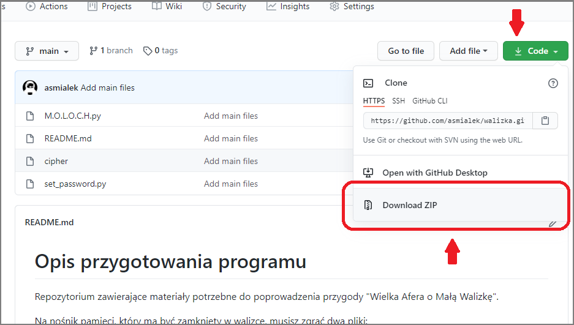

# Opis przygotowania programu
Repozytorium zawierające materiały potrzebne do poprowadzenia przygody "Wielka Afera o Małą Walizkę".

Na nośnik pamięci, który ma być zamknięty w walizce, musisz zgrać dwa pliki:
- `M.O.L.O.C.H.exe`
- `cipher` albo `set_password.exe`

Jeśli zgrasz plik `cipher`, to hasłem do konta **rudy102** w programie `M.O.L.O.C.H.exe` będzie `humanismachine`. Z drugiej strony, zgranie i wykonanie programu `set_password.exe` pozwala na ustawienie własnego hasła do programu `M.O.L.O.C.H.exe` (po ustawieniu hasła program należy oczywiście skasować). W obu przypadkach hasło jest zapisane w pliku `cipher`, zakodowane przy użyciu szyfru ROT13. Rozszyfrowanie zawartości pliku z hasłem nie jest jednak główną metodą odgadnięcia hasła - jest nią kartka z liczbami wskazującymi na strony, wiersze i słowa w książce która jest zamknięta wraz z nośnikiem pamięci w tytułowej walizce. Reszta szczegółów opisana jest w rozdziale **Rekwizyty** w treści przygody.

Wersje z rozszeżeniem `.py` pozwalają odtworzyć programy na innych systemach operacyjnych niż Windows - polecam jednak w takim wypadku dokładnie sprawdzić czy i jak działają.

# Jak ściągnąć pliki z repozytorium
Aby ściągnąć wszystkie pliki z repozytorium, należy kliknąć na zielony przycisk **Code**, a następnie **Download ZIP**. Poniższe zdjęcie pokazuje ten proces:

# Karty postaci i mechanika
Zawarty PDF z Kartami Postaci może być prostą mechaniką wystarczającą do zagrania "Wielkiej Afery o Małą Walizkę". Każdy gracz wybiera jedną kartę/rolę i uzupełnia wszystkie puste pola, poza Sztuczkami (jeśli ma wpisaną tylko jedną).

## Umiejętności
Podczas gry każda akcja nieposiadająca oczywistego rozwiązania może wymagać testu. Wykonuje się go rzucając k10 i dodadając +2 (umiejętności z dwoma plusami), +1 (umiejętność z jednym plusem), nic (umiejętność nie wpisana na kartę) albo -1 (umiejętność z minusem). Test uważa się za udany, jeśli suma będzie większa, lub równa, 7. Mistrz Gry może uwzględnić przychylne warunki pozwalając graczowi rzucić dwiema kostkami i wybrać wyższy wynik. Nieprzychylne warunki będą natomiast wymagały rzutu dwoma (albo trzema, przy niesamowicie wymagających akcjach) kostkami i wybrania najniższego wyniku.

## Sztuczki
Każdy gracz na początku przygody dostaje do wykorzystania jeden szton. W dowolnym momencie gry może go rzucić na stół i skorzystać ze Sztuczki opisanej na swojej karcie postaci. Każda sztuczka opisuje filmowe akcje, pozwólmy więc graczowi i postaci błyszczeć kiedy ich szton ląduje na stół.